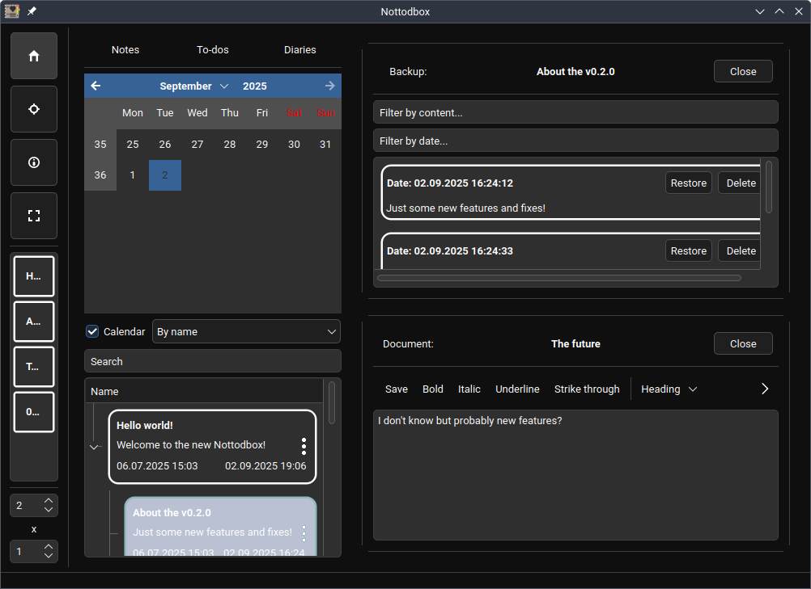

# Nottodbox
> [!TIP] 
> You can check [wiki](https://github.com/MuKonqi/nottodbox/wiki).

    </img> 
    </img> 
    </img>
     
    
    

Nottodbox allows you to create and organize notes, to-dos, and diaries with rich text support in popular formats.

In today&#39;s fast-paced world, we often have multiple tasks to handle simultaneously. That&#39;s why you can open multiple documents at once in the desired row x column layout.

You can change the style and color scheme of the application to make it feel more like home.

All customization options for documents/notebooks:

<ul>
    <li>You can mark a to-do as completed or uncompleted.</li>
    <li>You can add a content lock to a document to turn it into a diary. This prevents the backup from being changed.</li>
    <li>Documents are automatically saved unless you are editing a outdated diary and have disabled this feature. Additionally, a backup of the old content is always retained. Furthermore, auto-saves do not overwrite backups, meaning your manual changes remain intact.</li>
    <li>Documents can be in three formats: Markdown, HTML, and plain-text.</li>
    <li>Documents can be exported in multiple formats to your 'Documents' or 'Desktop' folder if you enable this feature. This allows you to edit them in other applications as well.</li>
    <li>You can pin your favorite documents/notebooks to the sidebar for easy access.</li>
    <li>You can change the background, text, and border colors of the document/notebook in three different states: normal, hover, and click</li>
</ul>

And here&#39;s the most important part! All documents are associated with a notebook, and all options can follow it. All documents/notebooks can use the default settings or follow the global settings. With them, you can to customize so many things with ease.

## Images

Show / Hide

## Using

### Installing via Flatpak from Flathub (only for Linux users) (recommended)
> [!WARNING]
> [Set up Flatpak](https://flatpak.org/setup/)

- `flatpak install io.github.mukonqi.nottodbox`

### Downloading executable from GitHub releases (recommended)

> [!CAUTION]
> If you can not run the file, check whether it is executable. If not, please make the file executable.

- [Download for Linux](https://github.com/MuKonqi/nottodbox/releases/latest/download/nottodbox.AppImage)
- [Download for macOS](https://github.com/MuKonqi/nottodbox/releases/latest/download/nottodbox.app.zip)
- [Download for Windows](https://github.com/MuKonqi/nottodbox/releases/latest/download/nottodbox.exe)

### Building a Flatpak

> [!WARNING]
> [Set up Flatpak](https://flatpak.org/setup/)

- Build: `wget https://raw.githubusercontent.com/flathub/io.github.mukonqi.nottodbox/refs/heads/master/io.github.mukonqi.nottodbox.yaml ; flatpak-builder --user --force-clean --install-deps-from flathub --install --sandbox .flatpak-builder/app io.github.mukonqi.nottodbox.yaml ; rm -rf .flatpak-builder io.github.mukonqi.nottodbox.yaml`
- Run: `flatpak run --branch=master --arch=x86_64 --command=nottodbox io.github.mukonqi.nottodbox`

### Building via pip

> [!WARNING] 
> Dependencies: Python (3.10 and higher), pip and git

> [!CAUTION] 
> Build command tested on bash and Python's executable's name may be different on your system.

- Build: `git clone https://github.com/mukonqi/nottodbox.git ; cd nottodbox ; python3 .github/scripts/translations.py ; pip install .`
- Run: `nottodbox`

### Building via PyInstaller

> [!WARNING] 
> Dependencies: Python (3.10 and higher), PySide6, PyInstaller and git

> [!CAUTION] 
> Build command tested on bash.

- Build for Linux: `export RUNNER_OS="Linux" ; python3 .github/scripts/consts.py ; bash .github/scripts/pyinstaller.sh`
- Build for macOS: `export RUNNER_OS="macOS" ; python3 .github/scripts/consts.py ; bash .github/scripts/pyinstaller.sh`
- Build for Windows: `export RUNNER_OS="Windows" ; python3 .github/scripts/consts.py ; bash .github/scripts/pyinstaller.sh`
- Now you can find the executable in dist folder.

### Running from source

> [!WARNING] 
> Dependencies: Python (3.10 and higher), PySide6 and git

> [!CAUTION] 
> Run command tested on bash and Python's executable's name may be different on your system.

- `git clone https://github.com/mukonqi/nottodbox.git ; cd nottodbox ; python3 .github/scripts/translations.py ; python3 -m nottodbox`

## Disclaimer

> [!CAUTION] 
> Nottodbox is distributed in the hope that it will be useful, but WITHOUT ANY WARRANTY; without even the implied warranty of MERCHANTABILITY or FITNESS FOR A PARTICULAR PURPOSE.

> [!TIP]
> You can see the license for more details.

## Credit

- While making [nottodbox/scripts/widgets/documents.py](./nottodbox/scripts/widgets/documents.py)'s DocumentHelper class, [KDE - Marknote: master/src/documenthandler.cpp](https://invent.kde.org/office/marknote/-/blob/master/src/documenthandler.cpp) helped me as a referance.